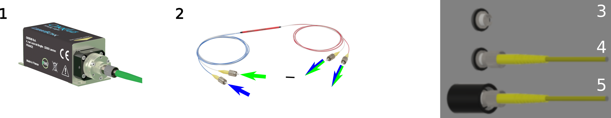
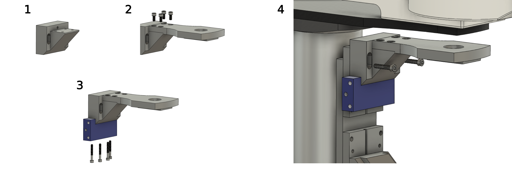
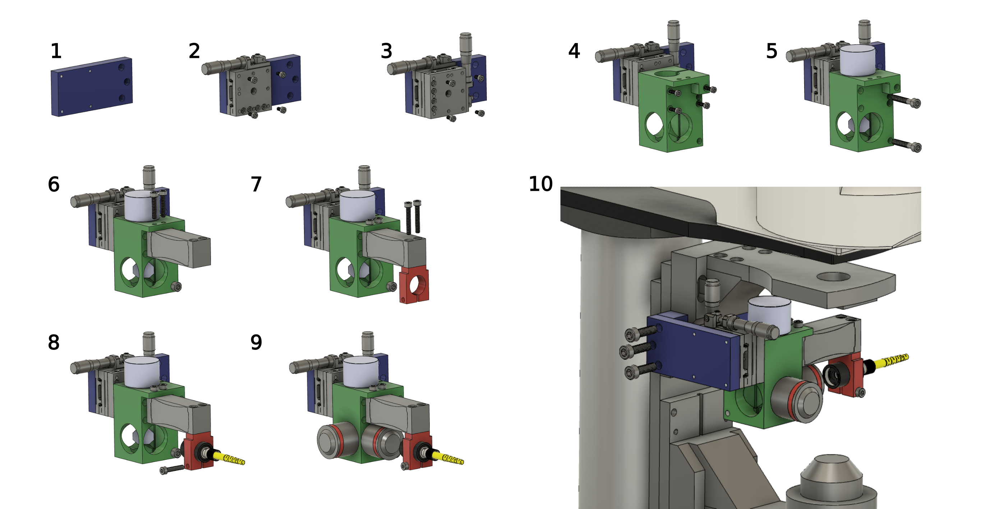
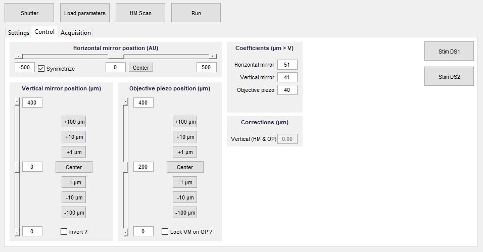
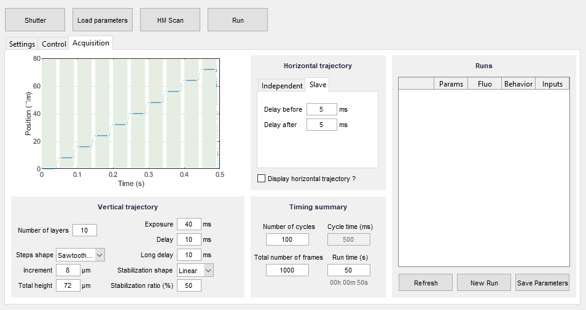
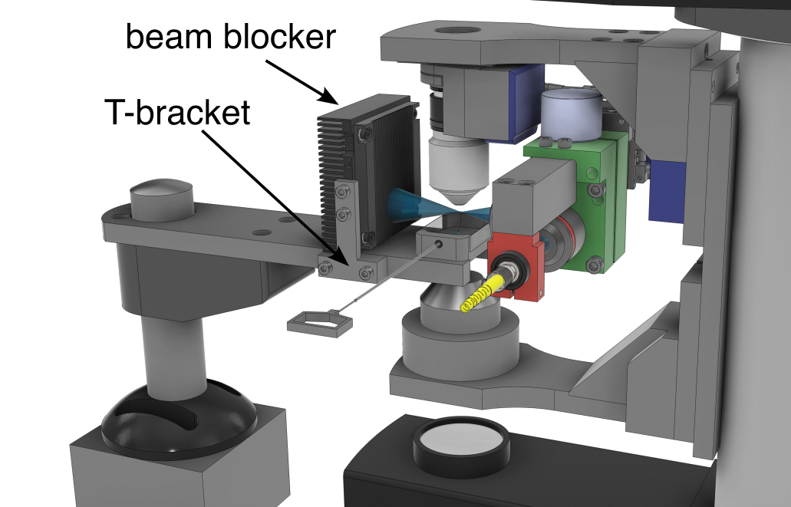

# The Multicolor One-Photon Light-Sheet Design

In this comprehensive guide, we provide detailed instructions on building the one-photon light-sheet system. Whether your ultimate goal is to construct the two-photon system or utilize the one-photon configuration, we highly recommend starting with the installation of the one-photon system. This sequential approach allows you to gain a solid foundation and a better understanding of the system's components and functionality, which will facilitate a smoother transition to the advanced two-photon configuration if desired.

The construction of the system can be done in two levels. In the first level, you can use the light-sheet unit as a standalone light source. This basic setup will enable you to perform one-photon imaging experiments effectively in the same manner as you would normally acquire epifluorecence images or stacks. In the second level, you have the option to computer-control the system and perform fast, high-precision volumetric scans. This advanced level of control opens up additional capabilities and enhances the versatility of the light-sheet unit for various imaging applications.

If your ultimate goal is to set up the two-photon version, you have the option to directly use optics optimized for infrared transmission in the initial one-photon installation. This strategic choice ensures compatibility and paves the way for a seamless transition to the two-photon configuration at minimal cost by avoiding the need for component replacements when upgrading to the two-photon version.

# Table of Content

- [Building Instructions](#building-instructions)
  * [Purchase List](#purchase-list)
  * [Custom Parts](#custom-parts)
    + [Pieces to Send for Milling](#pieces-to-send-for-milling)
    + [Pieces for 3D Printing](#pieces-for-3d-printing)
  * [Screw kit](#screw-kit)
  * [Let's Start to Assemble](#let-s-start-to-assemble)
    + [The Light-Sheet Unit](#the-light-sheet-unit)
      - [Laser and Fiber Coupling](#laser-and-fiber-coupling)
      - [Adapt the Scientifica Scope to receive the light-sheet unit](#adapt-the-scientifica-scope-to-receive-the-light-sheet-unit)
      - [Assemble the light-sheet unit](#assemble-the-light-sheet-unit)
      - [Laser Alignement](#laser-alignement)
    + [The Detection Path](#the-detection-path)
    + [Driving the Light-Sheet Unit](#driving-the-light-sheet-unit)
      - [Mode 1: Stand-Alone Light-Sheet Source Without the Need for Additional Computer Interfacing](#mode-1--stand-alone-light-sheet-source-without-the-need-for-additional-computer-interfacing)
      - [Mode 2: A Computer Controlled Light-Sheet Scanner](#mode-2--a-computer-controlled-light-sheet-scanner)
    + [The Sample Chamber Holder and Sample Chamber](#the-sample-chamber-holder-and-sample-chamber)
    + [Ensuring Laser Safety](#ensuring-laser-safety)
    + [Now Let's Align the System](#now-let-s-align-the-system)
  * [Photos of the System in Combination with an Electrophysiolgy System:](#photos-of-the-system-in-combination-with-an-electrophysiolgy-system-)
  * [Example Recordings:](#example-recordings-)
  * [A Conference Talk Presenting the System:](#a-conference-talk-presenting-the-system-)
  * [Upgrade the One-Photon Unit into a Two-Photon System by using a Hollowcore Crystal Fiber](#upgrade-the-one-photon-unit-into-a-two-photon-system-by-using-a-hollowcore-crystal-fiber)

<small><i><a href='http://ecotrust-canada.github.io/markdown-toc/'>Table of contents generated with markdown-toc</a></i></small>

# Building Instructions

## Purchase List

[List of parts](Partlist.md)

## Custom Parts

### Pieces to Send for Milling
    
These pieces are  milled out of an aluminum block. If you do not have a mechanical workshop in house then you can send the *.step files that we provide below to an [online milling service](https://xometry.eu/fr/usinage-cnc-fraisage-cnc/). For parts with threaded holes, join the mechanical drawings to the .step file.
* The light-sheet unit central cube: [View the 3D model](CAD_models/Cube.stl) or [download the CAD model as a step file](CAD_models/Cube.step) and [mechanical drawings](CAD_models/CubeMechanicalDrawings.pdf).
* The fiber holder  : [View the 3D model](CAD_models/FiberHolder.stl) or [download the CAD model as a step file](CAD_models/FiberHolder.step) and [mechanical drawings](CAD_models/FiberHolderMechanicalDrawings.pdf).
* Adaptor plate 1 : [View the 3D model](CAD_models/AdaptorPlate1.stl) or  [download the CAD model as a step file](CAD_models/AdaptorPlate1.step) and [mechanical drawings](CAD_models/AdaptorPlate1MechanicalDrawings.pdf).
* Adaptor plate 2 : [View the 3D model](CAD_models/AdaptorPlate2.stl) or  [download the CAD model as a step file](CAD_models/AdaptorPlate2.step) and [mechanical drawings](CAD_models/AdaptorPlate2MechanicalDrawings.pdf).
* Custom bracket : [View the 3D model](CAD_models/CustomBracket.stl) or  [download the CAD model as a step file](CAD_models/CustomBracket.step) and [mechanical drawings](CAD_models/CustomBracketMechanicalDrawings.pdf).
* Sample chamber holder : [View the 3D model](CAD_models/SampleChamberHolder.stl) or [download the CAD model as step file](CAD_models/SampleChamberHolder.step) and [mechanical drawings](CAD_models/SampleChamberHolderMechanicalDrawings.pdf).
* T-bracket to hold the beam trap : [View the 3D model](CAD_models/TBracket.stl) or [download the CAD model as step file](CAD_models/TBracket.step) and [mechanical drawings](CAD_models/TBracketMechanicalDrawings.pdf).
* Piezoactuator dummy : [View the 3D model](CAD_models/PiezoDummy.stl) or [download the CAD model as step file](CAD_models/PiezoDummy.step) and [mechanical drawings](CAD_models/PiezoDummyMechanicalDrawings.pdf). This piece is only necessary if you do not want to install the piezo actuator required for the fast scan mode.
    

### Pieces for 3D Printing
* [Sample chamber](CAD_models/SampleChamber.stl). You can download the [CAD model as step file](CAD_models/SampleChamber.step) here to send it to your 3D printing service.

## Screw kit
You will neet Hex Head Socket Cap metric screws:

| type          | length (cm)   | amount |
| ------------- | ------------- | ------ |
| M3            | 10            | 4      |
| M4            | 30            | 4      |
| M4            | 25            | 2      |
| M4            | 20            | 5      |
| M4            | 10            | 2      |
| M5            | 30            | 2      |
| M6            | 20            | 3      |

E.g. this [Srew kit](https://www.amazon.fr/huruirui-hexagonales-int%C3%A9rieures-inoxydable-rangement/dp/B0BNC63J21/ref=sr_1_21?__mk_fr_FR=%C3%85M%C3%85%C5%BD%C3%95%C3%91&crid=3MCQH28G0NEHV&keywords=vis%2BM3%2BM4%2BM5%2BM6%2B10%2F20%2F25%2F30&qid=1684324658&s=industrial&sprefix=vis%2Bm3%2Bm4%2Bm5%2Bm6%2B10%2F20%2F25%2F30%2Cindustrial%2C58&sr=1-21&th=1) will do it. 

## Let's Start to Assemble

### The Light-Sheet Unit

#### Laser and Fiber Coupling

(1) Purchase [continous lasers](https://www.oxxius.com/category-products/continuous-and-modulated-lasers/) of wavelength adapted for your experiments.  We use a blue 488nm and a green 561nm laser. Choose the option with [prealigned fiber coupler](https://github.com/vbormuth/OLU/files/9057780/WEBSITE-Datasheet-LBX-488.pdf).

(2) To combine the two lasers into a single mode fiber attach the two inputs of the [fiber optic coupler](https://www.thorlabs.com/thorproduct.cfm?partnumber=TW470R5F2) to the FC/PC connector of each laser. The blue and the green lasers will be combined and are available at both output fiber ports.

(3-5) Assemble the Fiber support tube: Take the [FC/PC connector](https://www.thorlabs.com/thorproduct.cfm?partnumber=SM05FC#ad-image-0) which will later hold the optical fiber that delivers the laser. Screw the connector into the [lens tube](https://www.thorlabs.com/thorproduct.cfm?partnumber=SM05M10) (black) but not too far so that you can easily attach and detach the optical fiber. Fix the connector with the two retaining rings.

#### Adapt the Scientifica Scope to receive the light-sheet unit

You will need to unscrew the bracket that holds the objective support plate from the original Scientifica setup.

https://github.com/vbormuth/OLU/assets/38736127/3badc957-37bb-4c94-9520-510adb2ce2c6

This bracket will then be replaced with a custom bracket that has holes to allow the light sheet unit to be attached to the Scientifica system in the next steps. 

(1-2) Attach the top plate (original piece unscrewed from Scientifica Scope) to the [Custom Bracket](CAD_models/CustomBracket.stl) (custom piece) by using the original screws.

(3) Attach [Adapter Plate 1](CAD_models/AdaptorPlate1.stl) (custom piece) with four M4x30 screws.

(4) Attach assembly to top Z-stage of the microscope with two original screws.

#### Assemble the light-sheet unit

(1) Start from [Adapter Plate 2](CAD_models/AdaptorPlate2.stl) (blue, custom piece).

(2) Attach the Horizontal Manual Stage to Adapter Plate 2 with four M3 screws included with the stage.

(3) Attach the Vertical Manual Stage to the Horizontal Manual Stage with four M3 screws included with the stage.

(4) Attach the [Light-Sheet Unit Central Cube](CAD_models/Cube.stl) (green, custom piece) to the Vertical Manual stage with four M3x10 screws.

(5) Insert the [Galvanometer Mirror](https://www.thorlabs.com/thorproduct.cfm?partnumber=GVS011) (light blue), align it at 45° relative to the sides of the Light-sheet Cube and cinch it in place with two M5x30 screws.

(6) Attach the [Piezocrystal (PZ 400 SG OEM)](https://www.piezosystem.com/product/pz-400-oem/) or if you want to start with a simple low cost version that uses only the slow scanning mode then install instead the [Piezo Dummy](CAD_models/PiezoDummy.stl) (custom piece) to the Light-sheet Cube with two M4x20 screws.

(7) Attach the [Fiber Holder](CAD_models/FiberHolder.stl) (red, custom piece) to the Piezo with two M4x25 screws.

(8) Insert the Fiber support tube (see points 3-5) into the Fiber Holder and cinch it with one M4x20 screw and and attach one of the output fibers of the fiber optic coupler to the connector (2).

(9) Screw in the 5x [Zeiss Plan-Neofluar Objectives (5x/0.16 M27)](https://www.micro-shop.zeiss.com/en/us/shop/objectives/420330-9901-000/Objective-EC-Plan-Neofluar-5x-0.16-M27). If you ultimate goal is to build the two-photon version then install in this step directly the  [Olympus LMPLN5xIR/0.1](https://www.olympus-lifescience.com/modules/pdfgen/pdfmaker/en_pdf-export_objectives.7efd53eb1e8b4d509bc1bbe2184a7e28/LMPLN5XIR.pdf?rev=1615725199) objectives that are optimized for near infrared transmission.

(10) Fix the Light-sheet Unit to the Scientifica Scope by attaching the Adapter Plate 2 to Adapter Plate 1 with three M6x20 screws.

#### Laser Alignement

(20) Before switching on the laser, prepare the room for laser safety (remove any jewellery, make sure no one is in the path of the laser and that the laser does not hit any reflective surfaces). Unscrew the focusing objective (Obj 2) of the light-sheet unit. Switch on the galvanometric mirror and then switch on the laser at low laser power. Adjust the distance of the fibre relative to the collimation lens until the laser exits the cube well collimated. To do this, move the fibre support tube (black) relative to the fibre holder (red).

(21) Next, carefully centre the beam in the opening where Obj 2 was screwed in by carefully adjusting the orientation of the galvanometer mirror. Once this is done, fix the mirror position with the fixing screw.

### The Detection Path

To configure the detection path you use the standard ports and configuration of the Scientifica scope.

* Use a detection objective that is best adapted to your application. If you want to install the fast z-scan mode then install the objective with an [objective scanning piezo system](https://www.pifrance.fr/fr/produits/platines-de-nanopositionnement-a-structure-deformable/support-objectif-pifoc-et-scanners-pinano-pour-la-microscopie/p-725-pifoc-objective-scanner-with-long-travel-range-200375/). Slow 
<!--- We used an [Olympus 20x objective](https://www.thorlabs.com/catalogpages/Obsolete/2019/N60XW-PF.pdf) in combination with a lens of 150mm focal length as [tube lens](https://www.thorlabs.com/thorproduct.cfm?partnumber=AC254-150-A) to reduce the magnification to 16x for the imaging system. --->
* Install the filters into the filter wheel
     * a [notch filter to block the 488nm laser line](https://www.thorlabs.com/thorproduct.cfm?partnumber=NF488-15)
     * a [GFP Emission Filter](https://www.thorlabs.com/thorproduct.cfm?partnumber=MF525-39).
* Attach the camera to the camera port. We used the [Hamamatsu ORCA-Flash4.0 V3 camera](https://www.hamamatsu.com/content/dam/hamamatsu-photonics/sites/documents/99_SALES_LIBRARY/sys/SCAS0134E_C13440-20CU_tec.pdf)

### Driving the Light-Sheet Unit

The light-sheet unit can be operated in two modes:

#### Mode 1: Stand-Alone Light-Sheet Source Without the Need for Additional Computer Interfacing

To drive the galvanometer, a simple and affordable [function generator](https://www.amazon.com/Generator-Precision-Dual-Channel-Arbitrary-Frequency/dp/B07H8CF2WV/ref=sr_1_3?crid=BMHYRYNELBAO&keywords=function+generator+JDS6600&qid=1685005539&sprefix=function+generator+jds6600%2Caps%2C273&sr=8-3) will suffice. Set the mirror to oscillate at approximately 400Hz with a triangular or sawtooth waveform.

If you already use your microscope with an image acquisition software that allows for acquiring z-stacks by controlling either the motorized stage of the z-focus or the piezo objective scanner, then you can operate the light-sheet unit in two modes.

**Slow Scan Mode:**

Even if you haven't installed the objective piezo scanner and the piezocrystal for moving the optical fiber, you can still perform volumetric recordings. Simply control the movement of the objective using the motorized stage of the scientifica scope, similar to a standard epifluorescence recording. Since the light-sheet unit is attached to the same stage as the objective, it will move along with the objective, ensuring that the light-sheet always illuminates the focal plane.

https://github.com/vbormuth/OLU/assets/38736127/971596a3-8630-45aa-8d89-9b84befc338a

#### Mode 2: A Computer Controlled Light-Sheet Scanner

**Fast Scan Mode:**

If you have installed a piezoactuator for both the imaging objective and the fiber, you can achieve high precision and fast volumetric recordings. Synchronizing the movement of the fiber with that of the objective is crucial to ensure that the light-sheet remains in the focal plane of the objective throughout the volumetric acquisition.

https://github.com/vbormuth/OLU/assets/38736127/8b75b67d-e0e4-44ea-af6d-0a4d4e075307

<!--- To achieve this synchronization, utilize your microscope control software to drive the objective scanner, and control the piezocrystal responsible for moving the fiber using the monitor signal from the controller of the focus scanner.
Calibrate the voltage with a [potentiometer???LINK??????](add link here ??????) --->

* To control the light-sheet volumetric scanning you can use our [custom developped control software](https://github.com/LaboJeanPerrin/Lightsheet) written in Matlab. Via a national instrument card [PCIe-6363](https://www.ni.com/fr-fr/support/model.pcie-6363.html) this software controls the the objective piezo scanner, the galvomirror and the piezo that moves the fiber to scan the light-sheet through the sample. The software is open source. 

* Alternatively, you can use:
    *  [ScanImage](https://www.scientifica.uk.com/products/vidrio-technologies-scanimage) the control software provided by Scientifica   
    *  [Micromanager](https://micro-manager.org/) that supports the control of all Scientifica stages as well as of most commen objective scanners from e.g. Physical Instrument or Piezo Jena.
    *  or the open source python software presented here: https://www.frontiersin.org/articles/10.3389/fcell.2022.875044/full

### The Sample Chamber Holder and Sample Chamber

* Install the [sample chamber holder](CAD_models/SampleChamberHolder.stl) (custom piece). 
* 3D print the [sample chamber](CAD_models/SampleChamber.stl). 

https://github.com/vbormuth/OLU/assets/38736127/12681a4f-9d83-438b-acc0-6e80867b9052

*  Take the 3D printed [sample chamber](CAD_models/SampleChamber.stl) and glue with [cyanoacrylate](https://uk.rs-online.com/web/p/glues/0473455) or [UV-curing adhesive](https://www.thorlabs.com/thorproduct.cfm?partnumber=NOA68) two glass windows on both sides as well as an [O-ring](https://www.oring.fr/joint-torique/22-1.html?search_query=&results=45) into the hole on the short side, which will allow you later to hold and position the sample via a [capillary](https://www.alphalabs.co.uk/5-000-2050) (inner diameter 0.85mm, outer diameter 1.47mm, length 115mm) for the imaging sessions. As glue we use a [UV glue](https://www.thorlabs.com/newgrouppage9.cfm?objectgroup_id=196&pn=NOA61) but you can also use standard cyanoacrylate. 

*  Place the sample chamber into the predefined opening of the sample chamber holder.)

<!--- https://www.fishersci.fi/shop/products/plunger-acura-capillary-micropipettes/p-8481034 --->

### Ensuring Laser Safety

Protect the experimenter from the laser by installing a [beam blocker](https://www.thorlabs.com/thorproduct.cfm?partnumber=LB2) in front of the sample chamber. Fix the [T-bracket](CAD_models/TBracket.stl) (custom piece) with two M4x20 screws to the [sample chamber holder](CAD_models/SampleChamberHolder.stl) and then fix the beam blocker with two M4x10 screws to the T-bracket. 

### Now Let's Align the System
* Fill the sample chamber with water and add a view drops of a 1.5mM fluorescein solution into the water filled sample chamber to visualize the laser. Switch-on the laser at low power until you can see the fluorescence laser profile. Be careful not to look directly into the laser and to keep working at low power (<1mW after excitation objective) for alignment. 
* The use of fluorescein requires cleaning with ethanol or isopropanol after alignment to remove residual fluorophores that may cause image noise. 
* It is also possible to use an agarose cylinder and observe the scattered light from the laser, to do this remove the filter between the detection objective and the camera and follow the same procedure.
* Align the laser waist under the detection objective by moving the entire light-sheet forming unit with the x-translation stage
* Switch on the camera and align the laser into the focal plane of the detection objective by moving the light-sheet forming unit with the z-translation stage until you see a sharp image of the laser with the camera. If you do not see the laser move the galvanometer mirror to bring the laser into the field of view.

https://github.com/vbormuth/OLU/assets/38736127/597ea417-c125-4dbb-acaa-2d7d1b02d45f

* Fine align the laser waist into the center of the field of view using the x-translation stage

https://github.com/vbormuth/OLU/assets/38736127/a1ec581d-8022-41e5-bffa-b81bc8f1b462

* Remov the fluorscein solution from the sample chamber and clean it. 
* Now generate the light-sheet by driving the galvanometer with a saw tooth pattern either with a function generator or via the control softward (see above). Adjust the amplitude of the movement such that the light-sheet covers exactly the field of view.
* Now you can place your prefered sample into the light-sheet and image it. Fine tune the z-position and x-position of the light-sheet until you get the sharpest image as possible.

* Now you can make 3D scannes of your sampel by manually moving the objective focus of the microscope or by recording 3D time lapse movies using your microscope control software. 
* Troubleshooting:
    * Your image is not sharp homogeneously across the field of view: The light-sheet might be tilted with respect to the focal plane of the detection objective.  In this case you can correct this by tilting slightly the entire unit. For this, unscrew slightly screws that fix the unit via the adapter plate to the microscope translation stage. Insert a thin paper partly between the adapter plate and the stage such that the unit gets tiltited in the correct direction once you refix the screws. Repeat this procedure until your image is in focus across the entire field of view.

## Photos of the System in Combination with an Electrophysiolgy System:

## Example Recordings:

Using the green laser. Shown is a high resolution recording of a zebrafish brain (6dpf) with a pan-neuronally expressed red calcium indicator (elav3-jRGECO):

https://user-images.githubusercontent.com/38736127/186108000-6d6c7374-28b0-485f-a63a-da5b19ce9631.mp4

## A Conference Talk Presenting the System:

## Upgrade the One-Photon Unit into a Two-Photon System by using a Hollowcore Crystal Fiber

[Click here for detailed instructions](2P-Upgrade.md)

