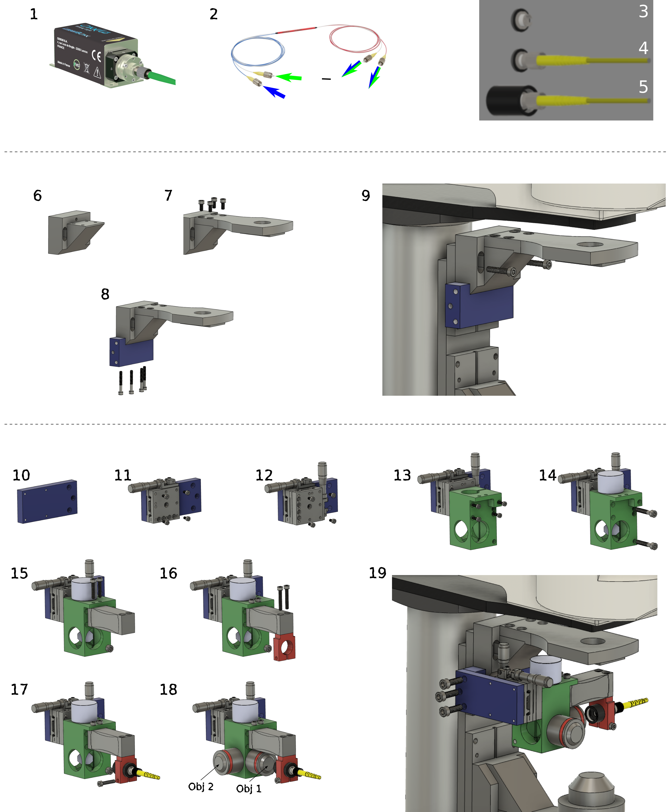
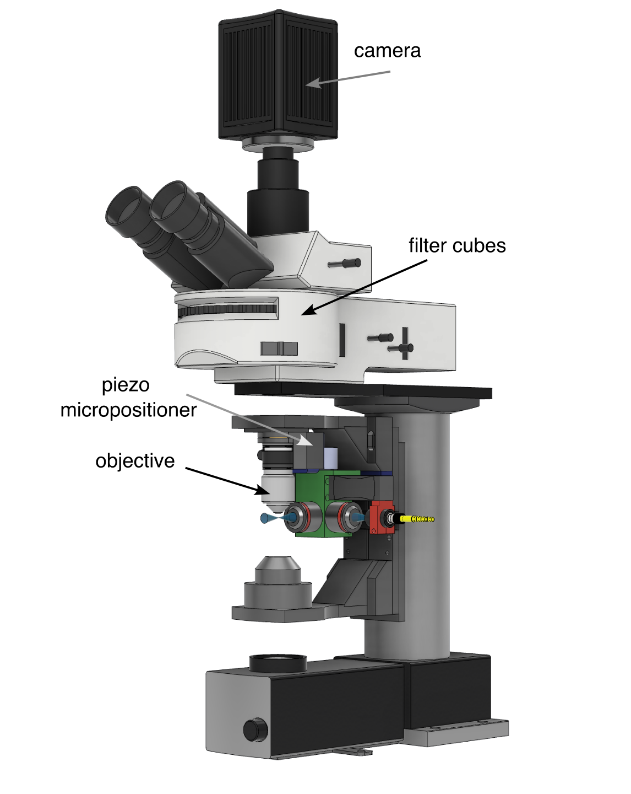
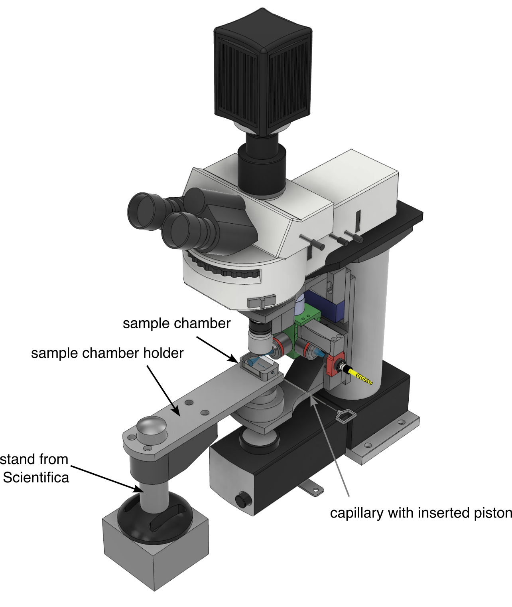

# Building instructions

## Purchase list

[List of parts](Partlist.md)

## Pieces to send for milling
    
    
These pieces are  milled out of an aluminum block. If you do not have a mechanical workshop in house then you can send the *.step files that we provide below to an [online milling service](https://xometry.eu/fr/usinage-cnc-fraisage-cnc/). For parts with threaded holes, join the mechanical drawings to the .step file.
* The light-sheet unit central cube: [View the 3D model](CAD_models/Cube.stl) or [download the CAD model as a step file](CAD_models/Cube.step) and [mechanical drawings](CAD_models/CubeMechanicalDrawings.pdf).
* The fiber holder  : [View the 3D model](CAD_models/FiberHolder.stl) or [download the CAD model as a step file](CAD_models/FiberHolder.step) and [mechanical drawings](CAD_models/FiberHolderMechanicalDrawings.pdf).
* Adaptor plate 1 : [View the 3D model](CAD_models/AdaptorPlate1.stl) or  [download the CAD model as a step file](CAD_models/AdaptorPlate1.step) and [mechanical drawings](CAD_models/AdaptorPlate1MechanicalDrawings.pdf).
* Adaptor plate 2 : [View the 3D model](CAD_models/AdaptorPlate2.stl) or  [download the CAD model as a step file](CAD_models/AdaptorPlate2.step) and [mechanical drawings](CAD_models/AdaptorPlate2MechanicalDrawings.pdf).
* Custom bracket : [View the 3D model](CAD_models/CustomBracket.stl) or  [download the CAD model as a step file](CAD_models/CustomBracket.step) and [mechanical drawings](CAD_models/CustomBracketMechanicalDrawings.pdf).
* Sample holder: [View the 3D model](CAD_models/SampleHolder.stl) or [download the CAD model as step file](CAD_models/SampleHolder.step) and [mechanical drawings](CAD_models/SampleHolderMechanicalDrawings.pdf).
* Piezoactuator dummy : [View the 3D model](CAD_models/PiezoDummy.stl) or [download the CAD model as step file](CAD_models/PiezoDummy.step) and [mechanical drawings](CAD_models/PiezoDummyMechanicalDrawings.pdf). This piece is only necessary if you do not want to install the piezo actuator required for the fast scan mode.
    

## Pieces for 3D printing
* [Sample chamber](CAD_models/SampleChamber.stl). You can download the [CAD model as step file](CAD_models/SampleChamber.step) here to send it to your 3D printing service.

## Screw kit
[Srew kit](https://www.amazon.fr/huruirui-hexagonales-int%C3%A9rieures-inoxydable-rangement/dp/B0BNC63J21/ref=sr_1_21?__mk_fr_FR=%C3%85M%C3%85%C5%BD%C3%95%C3%91&crid=3MCQH28G0NEHV&keywords=vis%2BM3%2BM4%2BM5%2BM6%2B10%2F20%2F25%2F30&qid=1684324658&s=industrial&sprefix=vis%2Bm3%2Bm4%2Bm5%2Bm6%2B10%2F20%2F25%2F30%2Cindustrial%2C58&sr=1-21&th=1)

## Let's start to assemble

### The light-sheet unit

#### Laser and fiber coupling
(1) Purchase [continous lasers](https://www.oxxius.com/category-products/continuous-and-modulated-lasers/) of wavelength adapted for your experiments.  We use a blue 488nm and a green 561nm laser. Choose the option with [prealigned fiber coupler](https://github.com/vbormuth/OLU/files/9057780/WEBSITE-Datasheet-LBX-488.pdf).

(2) To combine the two lasers into a single mode fiber attach the two inputs of the [fiber optic coupler](https://www.thorlabs.com/thorproduct.cfm?partnumber=TW470R5F2) to the FC/PC connector of each laser. The blue and the green lasers will be combined and are available at both output fiber ports.

(3-5) Assemble the Fiber support tube: Take the [FC/PC connector](https://www.thorlabs.com/thorproduct.cfm?partnumber=SM05FC#ad-image-0) which will later hold the optical fiber that delivers the laser. Screw the connector into the [lens tube](https://www.thorlabs.com/thorproduct.cfm?partnumber=SM05M10) (black) but not too far so that you can easily attach and detach the optical fiber. Fix the connector with the two retaining rings.

#### Adapt the Scientifica Scope to receive the light-sheet unit

(6-7) Attach the top plate (original piece unscrewed from Scientifica Scope) to the [Custom Bracket](CAD_models/CustomBracket.stl) (custom piece) by using the original screws.

(8) Attach [Adapter Plate 1](CAD_models/AdaptorPlate1.stl) (custom piece) with four M4x30 screws.

(9) Attach assembly to top Z-stage of the microscope with two original screws.

#### Assemble the light-sheet unit

(10) Start from [Adapter Plate 2](CAD_models/AdaptorPlate2.stl) (blue, custom piece).

(11) Attach the Horizontal Manual Stage to Adapter Plate 2 with four M3 screws included with the stage.

(12) Attach the Vertical Manual Stage to the Horizontal Manual Stage with four M3 screws included with the stage.

(13) Attach the [Light-Sheet Unit Central Cube](CAD_models/Cube.stl) (green, custom piece) to the Vertical Manual stage with four M3x10 screws.

(14) Insert the [Galvanometer Mirror]](https://www.thorlabs.com/thorproduct.cfm?partnumber=GVS011) (light blue), align it at 45° relative to the sides of the Light-sheet Cube and cinch it in place with two M5x30 screws.

(15) Attach the [Piezocrystal (PZ 400 SG OEM)](https://www.piezosystem.com/product/pz-400-oem/) or if you want to start with a simple low cost version that uses only the slow scanning mode then install instead the [Piezo Dummy](CAD_models/PiezoDummy.stl) (custom piece) to the Light-sheet Cube with two M4x20 screws.

(16) Attach the [Fiber Holder](CAD_models/FiberHolder.stl) (red, custom piece) to the Piezo with two M4x25 screws.

(17) Insert the Fiber support tube (see points 3-5) into the Fiber Holder and cinch it with one M4x20 screw and and attach one of the output fibers of the fiber optic coupler to the connector (2).

(18) Screw in the 5x [Objectives](https://www.micro-shop.zeiss.com/en/us/shop/objectives/420330-9901-000/Objective-EC-Plan-Neofluar-5x-0.16-M27).

(19) Fix the Light-sheet Unit to the Scientifica Scope by attaching the Adapter Plate 2 to Adapter Plate 1 with three M6x20 screws.

#### Laser alignement

(20) Before switching on the laser, prepare the room for laser safety (remove any jewellery, make sure no one is in the path of the laser and that the laser does not hit any reflective surfaces). Unscrew the focusing objective (Obj 2) of the light-sheet unit. Switch on the galvanometric mirror and then switch on the laser at low laser power. Adjust the distance of the fibre relative to the collimation lens until the laser exits the cube well collimated. To do this, move the fibre support tube (black) relative to the fibre holder (red).

(21) Next, carefully centre the beam in the opening where Obj 2 was screwed in by carefully adjusting the orientation of the galvanometer mirror. Once this is done, fix the mirror position with the fixing screw.

### The detection path

To configure the detection path you use the standard ports and configuration of the Scientifica scope.

* Use a detection objective that is best adapted to your application. If you want to install the fast z-scan mode then install the objective with an [objective scanning piezo system](https://www.pifrance.fr/fr/produits/platines-de-nanopositionnement-a-structure-deformable/support-objectif-pifoc-et-scanners-pinano-pour-la-microscopie/p-725-pifoc-objective-scanner-with-long-travel-range-200375/).
<!--- We used an [Olympus 20x objective](https://www.thorlabs.com/catalogpages/Obsolete/2019/N60XW-PF.pdf) in combination with a lens of 150mm focal length as [tube lens](https://www.thorlabs.com/thorproduct.cfm?partnumber=AC254-150-A) to reduce the magnification to 16x for the imaging system. --->
* Install the filters into the filter wheel
     * a [notch filter to block the 488nm laser line](https://www.thorlabs.com/thorproduct.cfm?partnumber=NF488-15)
     * a [GFP Emission Filter](https://www.thorlabs.com/thorproduct.cfm?partnumber=MF525-39).
* Attach the camera to the camera port. We used the [Hamamatsu ORCA-Flash4.0 V3 camera](https://www.hamamatsu.com/content/dam/hamamatsu-photonics/sites/documents/99_SALES_LIBRARY/sys/SCAS0134E_C13440-20CU_tec.pdf)

### Advanced version for fast volumetric imaging

If you have installed the imaging objective and the fiber with a piezoactuator then you can drive both piezos with the same control signa. 

* Use the monitor signal of the focus scanner as the control signal of the piezo crystal that drives the height of the fiber. Calibrate the voltage with a [potentiometer???LINK??????](add link here ??????)

### The sample chamber holder and sample chamber

* Install the [sample chamber support plate](CAD_models/SampleHolder.stl). This part is milled out of aluminum. You can download the [CAD step file of holder](CAD_models/SampleHolder.stp) here to send it to your milling service.
* 3D print the [sample chamber](CAD_models/SampleChamber.stl). You can download the [CAD step file of the sample chamber](CAD_models/SampleHolder.stp) here to send it to your 3D printing service.

(Figures/TankAnim.mp4)

https://github.com/vbormuth/OLU/assets/38736127/339b0a1c-8ea3-4ab0-ac4e-e25d764b4bd9

*   Glue with [cyanoacrylate](https://uk.rs-online.com/web/p/glues/0473455) or [UV-curing adhesive](https://www.thorlabs.com/thorproduct.cfm?partnumber=NOA68) two glass windows on both side as well as an [O-ring](https://www.oring.fr/joint-torique/22-1.html?search_query=&results=45) into the hole on the short side which will allow you later to hold and position the sample via a [capillary](https://www.alphalabs.co.uk/5-000-2050) (inner diameter 0.85mm, outer diameter 1.47mm, length 115mm) for the imaging sessions. (As glue we use a [UV glue](https://www.thorlabs.com/newgrouppage9.cfm?objectgroup_id=196&pn=NOA61) but you can also use standard cyanoacrylate. Place the sample chamber into the predefined opening of the sample holder.)

<!--- https://www.fishersci.fi/shop/products/plunger-acura-capillary-micropipettes/p-8481034 --->

### Now let's align the system
* Fill the sample chamber with water and add a drop of ????mM fluorescein to visualize the laser. Switch-on the laser at low power until you can see the fluorescence laser profile. Be careful not to look directly into the laser and to keep working at low power (<1mW after excitation objective) for alignment. 
* The use of fluorescein requires cleaning with ethanol or isopropanol after alignment to remove residual fluorophores that may cause image noise. 
* It is also possible to use an agarose cylinder and observe the scattered light from the laser, to do this remove the filter between the detection objective and the camera and follow the same procedure.

* Align the laser waist under the detection objective by moving the entire light-sheet forming unit with the x-translation stage
* Switch on the camera and align the laser into the focal plane of the detection objective by moving the light-sheet forming unit with the z-translation stage until you see a sharp image of the laser with the camera. If you do not see the laser move the galvanometer mirror to bring the laser into the field of view.
* Fine align the laser waist into the center of the field of view using the x-translation stage
* Now drive the galvanometer with a saw tooth pattern. You can do this without computer interfacing by using a [function generator????LINK??????](???????) via a function generator by using an [I/O-card????????LINK???????](?????????) and controlled via a dedicated [computer software](Software.md) to generate the light-sheet. Adjust the amplitude of the movement such that the light-sheet covers exactly the field of view.
* Now you can place your prefered sample into the light-sheet and image it (*DO NOT* forget to clean if you have used fluorescein)! Move the manual objective focus of the microscope and you can scan in 3D through your sample or record 3D time lapse movies using your microscope control software that synchronizes the objective movement with image acquisition.
* Troubleshooting:
    * Your image is not sharp homogeneously across the field of view: The light-sheet might be tilted with respect to the focal plane of the detection objective.  In this case you can correct this by tilting slightly the entire unit. For this, unscrew slightly screws that fix the unit via the adapter plate to the microscope translation stage. Insert a thin paper partly between the adapter plate and the stage such that the unit gets tiltited in the correct direction once you refix the screws. Repeat this procedure until your image is in focus across the entire field of view.

## Example recordings:

Using the green laser. Shown is a high resolution recording of a zebrafish brain (6dpf) with a pan-neuronally expressed red calcium indicator (elav3-jRGECO):

https://user-images.githubusercontent.com/38736127/186108000-6d6c7374-28b0-485f-a63a-da5b19ce9631.mp4

## Upgrade the one-photon unit into a two-photon system

[Click here for detailed instructions](2P-upgrade.md)

