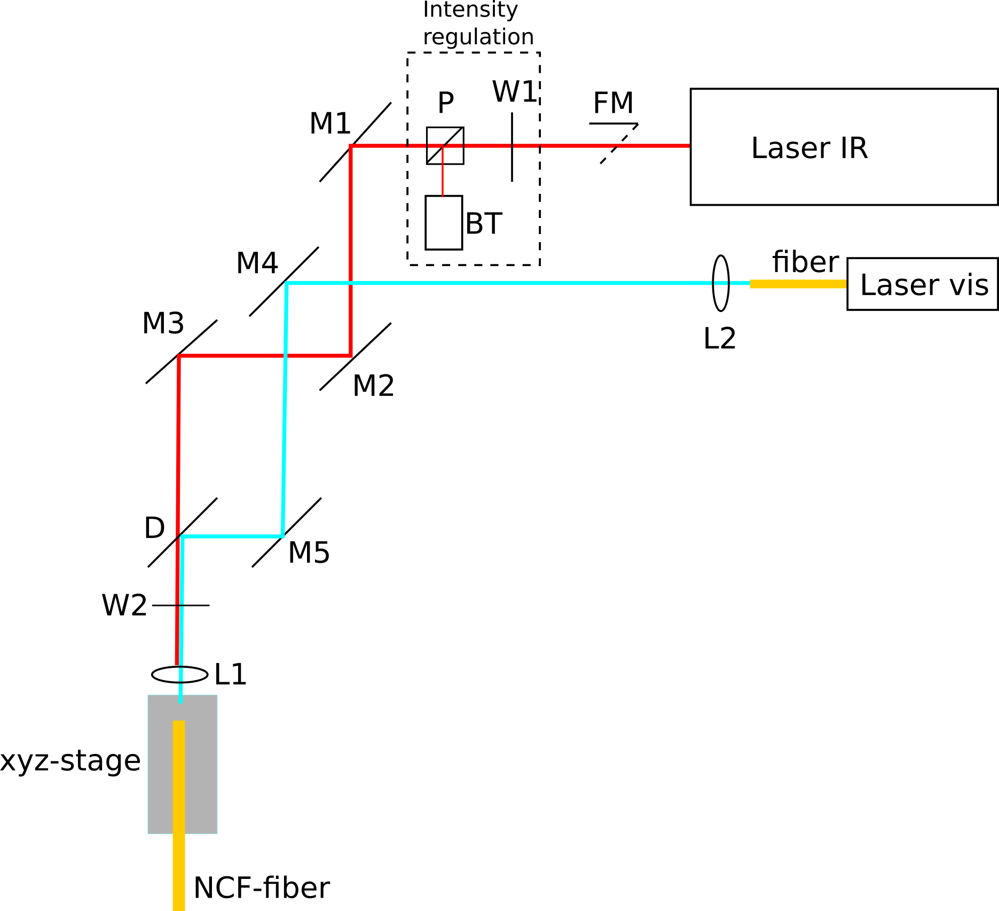

# Two-photon upgrade

In this comprehensive guide, we provide detailed instructions for upgrading the system to the two-photon configuration. Assuming that you have already built the one-photon version of the system, the upgrade primarily involves two main steps. First, you need to fiber couple a two-photon femtosecond pulsed laser into a negative hollow core optical fiber. Additionally, the fiber's numerical aperture at the output side should be increased for compatibility with the light-sheet unit. Secondly, if not already implemented, the objectives used in the light-sheet unit must be replaced with objectives optimized for near-infrared transmission. Finally, a filter needs to be installed in the detection path to block the infrared laser. These modifications will enable efficient two-photon imaging with the system.

# Table of Content

- [Part Liste](#part-liste)
- [Building Instructions](#building-instructions)
  * [Multiphoton Light-Sheet Unit](#multiphoton-light-sheet-unit)
  * [A Comprehensive Guide for Achieving Efficient Fiber Coupling of the Femtosecond Two-Photon Laser](#a-comprehensive-guide-for-achieving-efficient-fiber-coupling-of-the-femtosecond-two-photon-laser)
    + [Historical Background](#historical-background)
    + [The Negative Curvature Hollowcore Crystal Fiber](#the-negative-curvature-hollowcore-crystal-fiber)
    + [The Optical Path](#the-optical-path)
    + [Tips and Techniques for Laser Coupling into the Broadband Hollowcore Crystal Fiber](#tips-and-techniques-for-laser-coupling-into-the-broadband-hollowcore-crystal-fiber)
    + [Mastering the Handling of Hollow Core Fibers: Tips and Techniques](#mastering-the-handling-of-hollow-core-fibers--tips-and-techniques)
    + [Selecting the Optimal Coupling Lens: Criteria and Considerations](#selecting-the-optimal-coupling-lens--criteria-and-considerations)
    + [Let's Get Started: Building the System](#let-s-get-started--building-the-system)
      - [Coupling the IR Laser into the Broadband Fiber](#coupling-the-ir-laser-into-the-broadband-fiber)
      - [Coupling the Visible Laser into the Broadband Fiber](#coupling-the-visible-laser-into-the-broadband-fiber)
  * [Increasing the Fiber Numerical Aperture for Compatibility with the Light-Sheet Unit](#increasing-the-fiber-numerical-aperture-for-compatibility-with-the-light-sheet-unit)
  * [Modifying the Fluorescence Detection Path to Block Infrared Illumination](#modifying-the-fluorescence-detection-path-to-block-infrared-illumination)
  * [Alignement of the setup](#alignement-of-the-setup)
  * [Example of High Resolution Zebrafish Brain Recordings in One- and Two-Photon Mode (elav3:H2B-GCaMP6)](#example-of-high-resolution-zebrafish-brain-recordings-in-one--and-two-photon-mode--elav3-h2b-gcamp6-)

<small><i><a href='http://ecotrust-canada.github.io/markdown-toc/'>Table of contents generated with markdown-toc</a></i></small>

# Part Liste

# Building Instructions

## Multiphoton Light-Sheet Unit

The multiphoton light-sheet unit is basically identical in its design to the one photon multicolor desing. To build the two-photon system follow [the building instruction of the 1P-Multicolor system](1P_Multicolor_System.md) but take into account the following modification: 

Use in step (9) of the building instraction of the Light-sheet Unit as collimation and illumination objectives  the [Olympus LMPLN5xIR/0.1](https://www.olympus-lifescience.com/modules/pdfgen/pdfmaker/en_pdf-export_objectives.7efd53eb1e8b4d509bc1bbe2184a7e28/LMPLN5XIR.pdf?rev=1615725199) objective optimized for near infrared transmission. Even though not optimized for visible wavelength one can use this objective also for one-photon imaging later. To screw it into the light-sheet cube use a [thread adaptor](https://punchout.webdev02.thorlabs.com/thorproduct.cfm?partnumber=RMSA3).

## A Comprehensive Guide for Achieving Efficient Fiber Coupling of the Femtosecond Two-Photon Laser

### Historical Background
Efficient, dispersion-free, and broadband fiber coupling of a two-photon laser source is a long-standing challenge in the field of two-photon microscopy ([Helmchen et al., 2011](http://cshprotocols.cshlp.org/content/2013/10/pdb.top078147.long)) and of fiber optics design ([Wang et al., 2013](https://www.cambridge.org/core/journals/high-power-laser-science-and-engineering/article/hollowcore-photonic-crystal-fibre-for-high-power-laser-beam-delivery/8D2851845D043DA937A93F431D9F9D9C)). The difficulty arises from the fact that standard single-mode optical glass fibers are associated with strong linear and non-linear pulse dispersion, which reduces the two-photon efficiency. Pre-compensation methods are only efficient at low laser powers and are therefore impractical in the context of fast volumetric two-photon imaging, which requires high photonic fluxes. 

The development of single-mode photonic bandgap fibers, in which the light travels through an air filled hollow core, dramatically reduce dispersion and nonlinear effects and achieve transmission ratios greater than 50% ([Wang et al., 2013](https://www.cambridge.org/core/journals/high-power-laser-science-and-engineering/article/hollowcore-photonic-crystal-fibre-for-high-power-laser-beam-delivery/8D2851845D043DA937A93F431D9F9D9C), [Cregan et al., 1999](https://www.science.org/doi/10.1126/science.285.5433.1537)). These fibers have been successfully used for pulsed laser delivery in the context of multiphoton imaging ([Tai et al., 2004](https://opg.optica.org/abstract.cfm?URI=oe-12-25-6122), [Flusberg et al., 2005](https://opg.optica.org/abstract.cfm?URI=ol-30-17-2272), [Engelbrecht et al., 2008](https://opg.optica.org/abstract.cfm?URI=oe-16-8-5556), [Piyawattanametha et al,. 2009](https://opg.optica.org/abstract.cfm?&uri=ol-34-15-2309), [Choi et al., 2014](https://www.nature.com/articles/srep06626)). However, as the light guiding mechanism is based on the creation of an optical bandgap, these fibers only allow single wavelength transmission and are currently only commercially available for laser wavelengths of 800 nm or 1064 nm (NTK photonics). However, with the rapidly growing collections of genetically encoded actuators and sensors, broadband fiber delivery of the near infrared spectrum and optimally extended to visible wavelengths, is a prerequisite to take full advantage of 2P-LSFM in all possible applications while enabling laser source sharing between different setups.

Broadband fiber delivery spanning the visible and the near-infrared spectrum is possible with negative curvature hollow-core photonic crystal fibers (NCF), which do not rely on an optical bandgap for light-confinement ([Yu et al., 2016](https://opg.optica.org/abstract.cfm?URI=oe-24-12-12969), [Pryamikov et al., 2011](https://opg.optica.org/abstract.cfm?URI=oe-19-2-1441), [Yu et al., 2012](https://doi.org/10.1364/OE.20.011153)). The simplest cross-sectional geometry of an NCF is based on a ring of touching or non-touching tubes surrounding the core ([Pryamikov et al., 2011](https://opg.optica.org/abstract.cfm?URI=oe-19-2-1441)). Core diameter, tube diameter, inter-tube distance, and tube wall thickness together control the spectral transmission bands, the attenuation level, the quality of higher-order mode suppression, and the sensitivity of the optical properties to bending. Attenuation levels < 0.07 dB/km and bending loss < 0.03 dB/m are reported ([Debord et al., 2017](https://doi.org/10.1364/OPTICA.4.000209)). Due to the minimal lattice structure and the reduced light interaction with the cladding structure, these fibers have very high damage thresholds and can even be used for very high laser energy delivery of up to 100 $\mu\textrm{J}$ peak power when the core is vacuum pumped to reduce nonlinear effects at these high powers ([Li et al., 2019](https://doi.org/10.1016/j.ijleo.2019.163093)). Negative curvature fibers are on the verge of being used in several applications such as laser micromachining and laser surgery. A recent study demonstrated the successful use of a custom HC-NCF with a transmission band of 600 – 830 nm at < 0.3 dB/m attenuation in the design of a handheld two-photon microscopy scanner for human skin autofluorescence ([Sherlock et al., 2016](https://doi.org/10.1002/jbio.201500290)).

### Introducing Our Developed Negative Curvature Hollow Core Crystal Fiber

Together with [GLO Photonics](https://www.glophotonics.fr/), we selected a HC-NCF fiber whose optical characteristics appear to be ideally suited for laser delivery in the context of combined one- and two-photon light-sheet microscopy (). 

The outer fiber diameter is 200 ± 2 μm and the fiber coating diameter is 600 ± 30 μm. The fiber has an air-filled 30 μm-in-diameter core surrounded by a ring of eight non-contacting ~10 μm-in-diameter cladding tubes. In this so-called hypocycloid fiber structure, the negative curvature of the core contour is created by the tubes surrounding the core. Tube diameters, inter-tube distance, tube wall thickness, and core size together control the fiber transmission spectrum. They yield two broad transmission bands that are compatible with 1, 2, and 3P imaging, respectively (see ): One in the near infrared from 700 - 1500 nm (I), and another in the visible spectrum from 400 - 535 nm (II). Within these spectral bands, the loss is less than 300 dB/km (corresponding to a transmission efficiency of more than 93% for a one-meter-long fiber), and the pulse dispersion is less than 1 dB/(km·nm) of spectral pulse width. 

The fiber is commercially available as a patch chord cable with standard FC/PC connectors. This proves extremely convenient as it allows one to disconnect and reconnect the fiber to the optical setup without the need for subsequent realignment on either end. The small core diameter compared to the large infrared wavelength further ensures near single-mode guidance.

The Gaussian beam properties of the laser are also well preserved at the fiber output with M^2 values of 1.23 and 1.18 that we measured at 1030 nm and 515 nm laser wavelength. The near field and far field profiles are symmetric with minimal ellipticity of 97.25% and 85.57%. The mode field diameters at 1/e^2 are 23 ± 1 μm and 26 ± 1 μm, respectively, which correspond to a fiber's numerical aperture (NA) of approximately 0.02. Due to negligible interactions between the light and the fiber material, the fiber exhibits a very high damage threshold: We could not observe any fiber damage up to the maximal tested peak powers of 40 μJ at 1030 nm and 10 μJ at 515 nm for 400 fs pulses, corresponding to an average laser power of 20W and 4W, respectively. These characteristics demonstrate that high-quality Gaussian beams can be delivered with this fiber across a broad spectral range with high transmission and low dispersion, which is a prerequisite for its application in high-resolution microscopy.

### The Optical Path for Laser-to-Fiber Coupling
The following schematic and [3D model that you can interactively explore in 3D](https://a360.co/434IdMt) shows a possible optical path for the laser coupling. You can adapt the arrangement to the space availability on your setup (mirror, **M**, lens, **L**, dichroic, **D**, wave plate, **W**, polarizer, **P**, beam trap, **BT**):

If you do not have space on your table you can mount a platform on top of your IR pulsed laser source and bring the laser beam with a [periscope](https://www.thorlabs.com/newgrouppage9.cfm?objectgroup_id=883) up to the platform. 

We will give a step-by-step explanation that describes how to build this optical path and how to align the optical components to achieve optimal fiber coupling. But before we begin, we will give some preparatory notes and general background:

### Tips and Techniques for Laser Coupling into the Broadband Hollowcore Crystal Fiber
For the alignment we will follow a protocol well explained in an excellent YouTube tutorial that you find here and that we advise you to watch carefully before starting. The video explains a first prealignment step based on backpropagation of a laser in the reverse direction. To use this trick first connect a standard single mode fiber to the coupling unit. Use a fiber tester to inject a visible laser through the fiber. Then follow the steps as in the tutorial to co-align the alignment laser and the IR laser. Then disconnect the fiber and connect the hollow core fiber. If the first step was well done you should have directly transmission through the fiber enough to optimize the further fiber coupling as described in the tutorial. To watch the video just click on the snap shoot: 

### Mastering the Handling of Hollow Core Fibers: Tips and Techniques
* Here you find the [fiber spec sheet](https://github.com/vbormuth/OLU/files/9039097/PMC-C-K9005.B2_delivered_2019-01-16.pdf) of our hollow core negative curvature fiber 
* The hollow core fiber front face is not protected and cannot be easily polished, which is a standard procedure used for conventional single mode fibers. Also never try to clean the fiber outlet with ethanol or acetone because these solutions will enter the fiber core by capillary forces making the fiber unusable. You can use an [fiber inspection scope](https://www.thorlabs.com/thorproduct.cfm?partnumber=FS201) to inspect the fiber core.

* The fiber has a very high damage threshold but only if the laser is well coupled. So it is advice to do the alignment procedure at low laser power. This improves also laser safety. We will regulate the laser intensity with a rotatable [lambda wave plate](https://www.newport.com/p/10RP52-2) installed in series with a [polarizor]([https://www.thorlabs.com/thorproduct.cfm?partnumber=CCM1-PBS25-1064-HP](https://www.thorlabs.com/thorproduct.cfm?partnumber=CCM1-PBS252/M)). 

### Selecting the Optimal Coupling Lens: Criteria and Considerations

* For efficient optical coupling and suppression of higher laser modes the width of the laser focus projected onto the fiber input side has to [match the mode field diameter of the fiber](https://www.thorlabs.com/newgrouppage9.cfm?objectgroup_id=14203). Or in other words the opening angle of the focused laser beam has to match the numerical aperture of the fiber. Our fiber has a numerical aperture of 0.02 (see [fiber spec sheet](https://github.com/vbormuth/OLU/files/9039097/PMC-C-K9005.B2_delivered_2019-01-16.pdf)). The numerical aperture of the coupling system is given by $\textrm{NA} = \frac{D}{2 f}$, with $D$ the diameter of the laser beam at the position of the coupling lens, and $f$ the coupling lens' focal length.  The laser company normally gives the beam width and the beam divergent angle. In our case the Ti:Sapphire laser (MaiTai, Coherent, USA) has an output beam waist $<1.2\textrm{mm}$ and an divergent angle of $<0.001\textrm{mrad}$. We measured a beam diameter of 1.6mm at the position where we decided to install the coupling unit and we thus chose a coupling lens with focal length $f = \frac{D}{2\textrm{NA}} = \frac{1.6\textrm{mm}}{2\cdot 0.02} = 40\textrm{mm}$. We got reasonable coupling with the achromatic coupling lens. If you want to further optimize the coupling you can use an [objective](https://www.olympus-lifescience.com/modules/pdfgen/pdfmaker/en_pdf-export_objectives.7efd53eb1e8b4d509bc1bbe2184a7e28/LMPLN5XIR.pdf?rev=1615725199) as coupling lens. And you can install a telescope to adjust the beam diameter to match the fiber numerical aperture with the chosen coupling lens focal distance. Further tips for the fiber coupling can be found in the [manual from GLO-photonics](https://github.com/vbormuth/OLU/files/9039094/PIP_PMC-OEM.pdf).
* To measure the laser beam diameter use either a beam profiler (Thorlabs BC207VIS/M) or use the [moving knife technique](https://www.researchgate.net/profile/Emerson-Lima-2/publication/23771279_Measurement_of_Gaussian_laser_beam_radius_using_the_knife-edge_technique_Improvement_on_data_analysis/links/00b7d533ec8470fe22000000/Measurement-of-Gaussian-laser-beam-radius-using-the-knife-edge-technique-Improvement-on-data-analysis.pdf?origin=publication_detail). For the moving knife technique, fix a razor plate on a [linear translation stage](https://www.thorlabs.com/thorproduct.cfm?partnumber=XRN25C/M). For this use a [thin plate holder](https://www.thorlabs.com/thorproduct.cfm?partnumber=PC2/M), a [right angle clamp](https://www.thorlabs.com/thorproduct.cfm?partnumber=RA90) and a [post system](https://www.thorlabs.com/navigation.cfm?guide_id=52). Then move the knife perpendicular to the laser path step-by-step out of the laser beam while measuring the laser intensity as a function of the knife-edge position. The measured normalized power as a function of knife-edge position,  $x$  , can be fitted by  $P_N(x)=0.5\left[1 + erf \left(\frac{x-x0}{w_{e^{-1}}}\right)\right]$. The fit parameter $w_{e^{-1}}$ is the beam radius at $e^{-1}$. You can also read $w_{e^{-1}}$ from the graph as half of the distance between the positions where the normalized power has a value between 0.08 and 0.92. Note that the beam diameter, $D$ ,relevant to calculate the numerical aperture is measured at $e^{-2}$ and is thus given by  $D = 2 \cdot w_{e^{-2}} = 2 \cdot \sqrt{2} w_{e^{-1}}$    

### Let's Get Started: Building the System

#### Coupling the IR Laser into the Broadband Fiber
*	Position the [motorized flip mount](https://www.thorlabs.com/thorproduct.cfm?partnumber=MFF101/M) (**FM**) holding a [protected silver mirrors](https://www.thorlabs.com/thorproduct.cfm?partnumber=PF05-03-P01) directly after the infrared laser output to hijack the laser for coupling into the optical fiber. Flipping the mirror allows to select the setup into which you want to direct the laser. Alternatively, you can use a [beam splitter](https://www.thorlabs.com/newgrouppage9.cfm?objectgroup_id=6208&pn=BS033) to use the laser source on both setups simultaneously. The pertinence of the latter solution depends on the  laser power that you need in both setups for your experiments. For a standard scanning two-photon system you need in average < 100mW. The MaiTai laser has an average output power of 1.8mw at 915nm wavelength. With a 90:10% beam splitter and assuming 50% loss of laser power until the sample you can perform light-sheet microscopy with an average laser power of 400mW and two-photon scanning on the standard system with a mean power of 90mW. 
*	Next install the optics to control the laser intensity. Position the [lambda wave plate](https://www.newport.com/p/10RP52-2) and the [polarizor]([https://www.thorlabs.com/thorproduct.cfm?partnumber=CCM1-PBS25-1064-HP](https://www.thorlabs.com/thorproduct.cfm?partnumber=CCM1-PBS252/M)) in series. 
*   Before switching on the laser prepare for laser safety in the room and wear [laser safety glasses](https://www.thorlabs.com/thorproduct.cfm?partnumber=LG3) to protect your eyes!
*   Install the [power meter](https://www.thorlabs.com/thorproduct.cfm?partnumber=PM130D) to measure laser intensity after the polarizer (**P**)
*   Switch on the laser and rotate the wave plate until the transmitted laser power is minimal. 
*   Increase again slowly the laser power until you start to see the laser spot onto the [IR detection card](https://www.thorlabs.com/thorproduct.cfm?partnumber=VRC5)
*   Close the laser shutter
*   Position the two [protected silver mirrors](https://www.thorlabs.com/thorproduct.cfm?partnumber=PF05-03-P01) (**M1, M2 & M3**) mounted in [kinematic mirror mounts](https://www.thorlabs.com/thorproduct.cfm?partnumber=POLARIS-K05#ad-image-0). WIth mirror **M2** and **M3** you will later align the laser with the fiber axis. A good distance between these two mirrors is about 20cm. Select the height of the [posts](https://www.thorlabs.com/newgrouppage9.cfm?objectgroup_ID=9079) that hold the mirrors compatible with the height of your laser beam.
*  Install the [long pass dichroic mirror](https://www.thorlabs.com/thorproduct.cfm?partnumber=DMLP650R) (**D**) that is transparent for the infrared laser but reflects the visible spectrum . This will allow later the coupling of an addition visible laser into the same fiber. 
*	Mount the differential **xyz-translation stage** ([MAX313D/M](https://www.thorlabs.com/thorproduct.cfm?partnumber=MAX313D/M#ad-image-0)) at about 20cm distance of mirror **M3**. With this stage you will position the fiber outlet precisely into the focal point of the coupling lens. You might have to mount this stage on a platform to match the beam height  (**Custom piece for compatibility with a MaiTai laser: [Mechanical drawing](CAD_models/NanoMax_Pedestal.pdf), [.stl file](CAD_models/NanoMax_Pedestal.stl) and [.step file](CAD_models/NanoMax_Pedestal.step)**). Alternatively you can lower the beam path with a [periscope](https://www.thorlabs.com/newgrouppage9.cfm?objectgroup_id=883).  
*  Install the [half-wave plate](https://www.newport.com/p/10RP52-2B) (W2) mounted in a [high-precision rotation mount](https://www.thorlabs.com/thorproduct.cfm?partnumber=PRM1/M) to adjust the polarization of the laser.  For highest signal in two-photon microscopy you want to align the laser polarisation into the light-sheet plane. You can do this later by rotating this waveplate until you have maxiumal fluorscence. 
*  Fix the  [mounting bracket](https://www.thorlabs.com/thorproduct.cfm?partnumber=AMA009) onto the non-moving front of the **xyz-stage** and mount onto it a [SM1-Compatible Flexure Stage Mount](https://www.thorlabs.com/thorproduct.cfm?partnumber=HCS031) to hold the coupling lens **L1**.
*  Screw the coupling lens into the holder ([AC254-040-B-ML](https://www.thorlabs.com/thorproduct.cfm?partnumber=AC254-040-B-ML)) 
*  Mount the [SM1-compatible flexure stage mount](https://www.thorlabs.com/thorproduct.cfm?partnumber=HCS031) onto the moving platform of the xyz-stage and screw into this mount the [FC/PC fiber adapter plate with its external SM1 threading](https://www.thorlabs.com/thorproduct.cfm?partnumber=SM1FC2). To this FC/PC adapter you will later connect the optical fiber.
*	Attach the [single mode fiber](https://www.thorlabs.com/thorproduct.cfm?partnumber=P1-460B-FC-2) for prealignment to the FC/PC adaptor plate. 
*	Attach the other side of the fiber to the [cable continuity tester](https://www.flukenetworks.com/datacom-cabling/fiber-testing/VisiFault-Visual-Fault-Locator) for prealignment.
*	Switch on the red laser of the continuity tester. You should see the laser exiting out of the other side of the fiber
*	Adjust the distance of the coupling lens (**L1**) relative to the fiber outlet until the red laser light from the continuity tester is well collimated by the coupling lens. 
*	Now follow the alignment steps explained in the YouTube tutorial. Eventually, watch the video again.
*	Now where you know how to do it insure laser safety in the room and wear [laser safety glasses](https://www.thorlabs.com/thorproduct.cfm?partnumber=LG3) to protect your eyes!
*	Prepare a [VIS/IR Detector Card](https://www.thorlabs.com/thorproduct.cfm?partnumber=VRC2) to visualize the invisible infrared laser
*   Open the laser shutter.
*   Now move the two mirrors **M2** and **M3** to co-align the red laser and the IR laser as was explained in the video.
*   Switch off the laser shutter
*   Detach the single mode fiber from the coupling unit
*   Attach the [negative curvature broad band hollow core fiber](https://github.com/vbormuth/OLU/files/9039097/PMC-C-K9005.B2_delivered_2019-01-16.pdf) to the coupling unit.
*   Position the power meter before the coupling lens and adjust the power to about ???mW.
* Install an FC/PC adaptor plate and fix to it the other end of the fiber. Install the power meter just after the fiber to measure the transmitted laser power.
* Open again the laser shutter. You should measure laser transmission through the fiber.
* Now adjust the mirrors **M2** and **M3** as was described in the video until you get > 90% laser transmission. 
* Close the laser shutter 

#### Coupling the Visible Laser into the Broadband Fiber
* Fix the [fiber coupled laser](https://github.com/vbormuth/OLU/files/9057780/WEBSITE-Datasheet-LBX-488.pdf) onto the table.
* Position mirror **M3** and **M4** with a distance of about 20cm between each other and such that mirror **M4** is placed about 20cm from the coupling lens. As mirrors choose again [protected silver mirrors](https://www.thorlabs.com/thorproduct.cfm?partnumber=PF05-03-P01) mounted in [kinematic mirror mounts](https://www.thorlabs.com/thorproduct.cfm?partnumber=POLARIS-K05#ad-image-0) to align the laser with the fiber axis. Select the length of the [posts](https://www.thorlabs.com/newgrouppage9.cfm?objectgroup_ID=9079) compatible with the hight of your laser beam.
* Attach the fiber splitter to the laser that you purchases with prealigned fiber coupler.
* Install a [prealigned fiber collimators](https://www.thorlabs.com/thorproduct.cfm?partnumber=F110FC-532) **L2** that you mount into a [kinematic mirror mount](https://www.thorlabs.com/thorproduct.cfm?partnumber=KM05/M#ad-image-0) using an [adaptor](https://www.thorlabs.com/thorproduct.cfm?partnumber=AD11BA) and positioned onto the adequate [posts](https://www.thorlabs.com/thorproduct.cfm?partnumber=TR1) and its [universal post holder](https://www.thorlabs.com/thorproduct.cfm?partnumber=UPH1).
     * We selected the collimation lens focal distance with the formula: $f_{collimation} = f_{coupling} \cdot  \frac{NA_{fiber}}{NA_{laser fiber}} = 40\textrm{mm} \cdot \frac{0.02}{0.13}$
which boils down to the fact to choose the collimation lens focal distance such that the collimated laser beam diameter matches the diameter of the infrared beam that we previously coupled into the fiber using the chosen coupling lens. 
* Attach one of the outputs of the fiber coupler to this collimator lens. 
* Attach the other side to the FC/PC connector plate on the **xyz-stage** of the coupling unit. If the fiber is to short you can extend it with a [fiber-to-fiber connector](https://www.thorlabs.com/thorproduct.cfm?partnumber=ADAF1) and the single mode fiber that you have used in the previous prealignment step.
* prepare laser safety and switch on the laser at lowest power possible were you can see with the [VIS/IR Detector Card](https://www.thorlabs.com/thorproduct.cfm?partnumber=VRC2) the laser.
* Now use the mirror **M3** and **M4** to co-align the two laser beams that travel in reverse direction through the system as explained in the alignment YouTube tutorial. 
* Switch off the laser and replace the single mode fiber that is connected to the coupling unit with the negative curvature fiber.
* Switch the laser again on.
* You should detect with the power meter a transmission through the fiber.
* Adjust mirror **M3** and **M4** until you have more than 75% percent of transmission

At 915nm wavelength, the central two-photon absorption peak of GFP and of its calcium sensitive derivative GCaMP, we delivered through 1.5m fiber length 100fs laser pulses with 98% power transmission efficiency and minute pulse dispersion of 28nm (1dB/km·nm) that we fully precompensated with the Deepsee element of the MaiTai laser source. At 488nm,  the one-photon excitation maximum of GFP and GCaMP, we achieved a transmission efficiency of ~75%. 

[Go back to the main page](README.md)

## Increasing the Fiber Numerical Aperture for Compatibility with the Light-Sheet Unit

* The collimation and illumination objective form a one-to-one telescope. If we would simply connect the hollow core fiber to the light-sheet unit as we did in the 1P-Multicolor system then the light-sheet thickness would correspond to the mean field diameter of the hollow core fiber which is $23\mu m$ ([fiber spec sheet](https://github.com/vbormuth/OLU/files/9039097/PMC-C-K9005.B2_delivered_2019-01-16.pdf)). To get the same resolution as in the one-photon implementation we have to install an extra lens after the fiber to demagnify the laser waist from the fiber output to about $5\mu m$ and at the same time to increase the divergence angle of the laser to match the numerical aperture of the collimation objective. The numerical aperture of the fiber is 0.02 and thus a factor 5 times smaller compared to the numerical aperture of the detection objective.
* With a [lens](https://www.thorlabs.com/thorproduct.cfm?partnumber=C151TMD-B) with a focal distance of f = 2mm and a numerical aperture of 0.5 you can demagnify the laser output from the fiber by a magnification of m = 0.2. Mount this lens via an [adaptor](https://www.thorlabs.com/thorproduct.cfm?partnumber=S05TM06) into the the [lens tube](https://www.thorlabs.com/thorproduct.cfm?partnumber=SM05M10) which you prepared in step (5-7) of the [manual of the 1P-Multicolor unit](1P_Multicolor_System.md).  
* Place the lens at a distance $s = f \left( \frac{1}{m} - 1\right) = f \left( 5 - 1\right) = 4 \cdot f = 8\textrm{mm}$ after the fiber output. The lens refocuses the laser at a new position $s' = f \cdot \left[ 1 + \frac{1}{s/f - 1} \right] = 1.2 \cdot f = 2.4\textrm{mm}$ after the lens down to a waist of $w_0^{'} = m \cdot w_0 = 0.2 \cdot 23 \mu m = 4.6\mu m$ with an angle of divergence of the laser corresponding to a numerical aperture of $m \cdot 0.02 = 0.1$ thus matching the numerical aperture of the collimation objective.

[Focusing of spherical Gaussian beams by Sidney A. Self](https://citeseerx.ist.psu.edu/viewdoc/download?doi=10.1.1.1091.571&rep=rep1&type=pdf)

## Modifying the Fluorescence Detection Path to Block Infrared Illumination
* Install in addition the [multiphoton short-pass emission filter](https://www.semrock.com/filterdetails.aspx?id=ff01-750/sp-25) to block also the pulsed infrared laser source.

## Alignement of the setup

* Align the system in one-photon mode following the instructions provided for the [1P-Multiphoton system](1P_Multicolor_System.md). This alignment procedure will also align the two-photon pathway.

* Align the polarization of the two-photon laser within the light-sheet plane. Visualize the two-photon laser using a fluorescein solution. Rotate wave plate W2, which is installed in front of the xyz-translation stage in the fiber coupling optical pathway. Continue rotating the wave plate until the fluorescence signal is maximized, indicating the optimal position.

* Note that the alignment and transmission efficiency of the hollow-core fiber in the infrared are not affected by fiber bendings. However, bending the fiber will indeed affect the polarization by changing its direction and ellipticity. Once you have set the rotation angle of wave plate W2, it is crucial not to move the fiber any further. If the fiber is inadvertently moved, the rotation angle of the wave plate will need to be readjusted accordingly to ensure optimal performance. For further information regarding the dependency of light-sheet fluorescence microscopy on polarization, please refer to [Vito et al. Optic Express 2020](https://opg.optica.org/boe/fulltext.cfm?uri=boe-11-8-4651&id=433823).

## Example of High Resolution Zebrafish Brain Recordings in One- and Two-Photon Mode (elav3:H2B-GCaMP6)

* Left: one-photon mode excited @ 488nm
* Right:  two-photon mode excited @ 915nm

https://user-images.githubusercontent.com/38736127/178161973-748767bf-004d-487c-9377-4582a705d8d7.mp4
