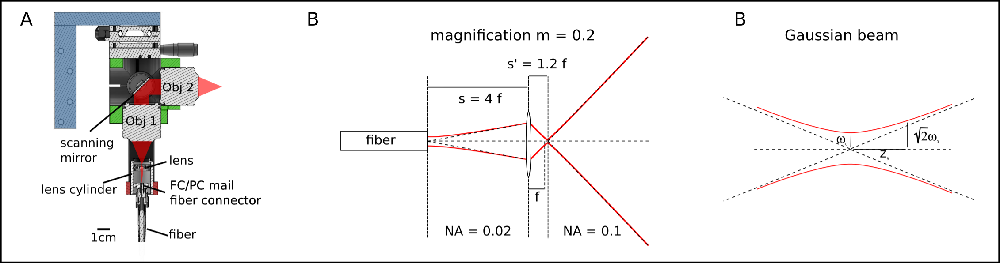

# Table of Content
- [Two-photon upgrade](#two-photon-upgrade)
  * [Part Liste](#part-liste)
  * [Building Instructions](#building-instructions)
    + [Multiphoton Light-sheet unit](#multiphoton-light-sheet-unit)
    + [Fiber coupling of the pulsed femtosecond laser](#fiber-coupling-of-the-pulsed-femtosecond-laser)
    + [Install and adjust the NA expander](#install-and-adjust-the-na-expander)
  * [Detection path](#detection-path)
  * [Alignement](#alignement)
  * [Example high resolution zebrafish brain recordings (elav3:H2B-GCaMP6)](#example-high-resolution-zebrafish-brain-recordings--elav3-h2b-gcamp6-)

<small><i><a href='http://ecotrust-canada.github.io/markdown-toc/'>Table of contents generated with markdown-toc</a></i></small>

# Two-photon upgrade

## Part Liste

## Building Instructions

### Multiphoton Light-sheet unit

The two-photon system is basically identical in its design to the 1P-Multiphoton light-sheet system. To build the two-photon system follow [the building instruction of the 1P-Multicolor system](1P_Multicolor_System.md) but take into account the following modifications: 

* Use in step (3) as collimation and illumination objectives  the [Olympus LMPLN5xIR/0.1](https://www.olympus-lifescience.com/modules/pdfgen/pdfmaker/en_pdf-export_objectives.7efd53eb1e8b4d509bc1bbe2184a7e28/LMPLN5XIR.pdf?rev=1615725199) objective optimized for near infrared transmission. Even though not optimized for visible wavelength one can use this objective also for one-photon imaging later. To screw it into the light-sheet cube use a [thread adaptor](https://punchout.webdev02.thorlabs.com/thorproduct.cfm?partnumber=RMSA3).

### Fiber coupling of the pulsed femtosecond laser
* In addition to step (2) , couple the **two-photon laser** and the **one-photon laser** sources into a single hollow core crystal fiber for combined fiber delivery to the light-sheet unit. Find here a [detailed instruction of the coupling procedure](Fiber_coupling.md) and here some background about [hollow core negative curvature fibers](FiberOpticsReview.md).

### Install and adjust the NA expander

* The collimation and illumination objective form a one-to-one telescope. If we would simply connect the hollow core fiber to the light-sheet unit as we did in the 1P-Multicolor system then the light-sheet thickness would correspond to the mean field diameter of the hollow core fiber which is $23\mu m$ ([fiber spec sheet](https://github.com/vbormuth/OLU/files/9039097/PMC-C-K9005.B2_delivered_2019-01-16.pdf)). To get the same resolution as in the one-photon implementation we have to install an extra lens after the fiber to demagnify the laser waist from the fiber output to about $5\mu m$ and at the same time to increase the divergence angle of the laser to match the numerical aperture of the collimation objective. The numerical aperture of the fiber is 0.02 and thus a factor 5 times smaller compared to the numerical aperture of the detection objective.
* With a [lens](https://www.thorlabs.com/thorproduct.cfm?partnumber=C151TMD-B) with a focal distance of f = 2mm and a numerical aperture of 0.5 you can demagnify the laser output from the fiber by a magnification of m = 0.2. Mount this lens via an [adaptor](https://www.thorlabs.com/thorproduct.cfm?partnumber=S05TM06) into the the [lens tube](https://www.thorlabs.com/thorproduct.cfm?partnumber=SM05M10) which you prepared in step (5-7) of the [manual of the 1P-Multicolor unit](1P_Multicolor_System.md).  
* Place the lens at a distance $s = f \left( \frac{1}{m} - 1\right) = f \left( 5 - 1\right) = 4 \cdot f = 8\textrm{mm}$ after the fiber output. The lens refocuses the laser at a new position $s' = f \cdot \left[ 1 + \frac{1}{s/f - 1} \right] = 1.2 \cdot f = 2.4\textrm{mm}$ after the lens down to a waist of $w_0^{'} = m \cdot w_0 = 0.2 \cdot 23 \mu m = 4.6\mu m$ with an angle of divergence of the laser corresponding to a numerical aperture of $m \cdot 0.02 = 0.1$ thus matching the numerical aperture of the collimation objective.

[Focusing of spherical Gaussian beams by Sidney A. Self](https://citeseerx.ist.psu.edu/viewdoc/download?doi=10.1.1.1091.571&rep=rep1&type=pdf)

## Detection path
* Install in addition the [multiphoton short-pass emission filter](https://www.semrock.com/filterdetails.aspx?id=ff01-750/sp-25) to block also the pulsed infrared laser source.

## Alignement

* Align the system in one-photon mode following the instructions provided for the [1P-Multiphoton system](1P_Multicolor_System.md). This alignment procedure will also align the two-photon pathway.

* Align the polarization of the two-photon laser within the light-sheet plane. Visualize the two-photon laser using a fluorescein solution. Rotate wave plate W2, which is installed in front of the xyz-translation stage in the fiber coupling optical pathway. Continue rotating the wave plate until the fluorescence signal is maximized, indicating the optimal position.

* Note that the alignment and transmission efficiency of the hollow-core fiber in the infrared are not affected by fiber bendings. However, bending the fiber will indeed affect the polarization by changing its direction and ellipticity. Once you have set the rotation angle of wave plate W2, it is crucial not to move the fiber any further. If the fiber is inadvertently moved, the rotation angle of the wave plate will need to be readjusted accordingly to ensure optimal performance. For further information regarding the dependency of light-sheet fluorescence microscopy on polarization, please refer to [Vito et al. Optic Express 2020](https://opg.optica.org/boe/fulltext.cfm?uri=boe-11-8-4651&id=433823).

## Example high resolution zebrafish brain recordings (elav3:H2B-GCaMP6)

* Left: one-photon mode excited @ 488nm
* Right:  two-photon mode excited @ 915nm

https://user-images.githubusercontent.com/38736127/178161973-748767bf-004d-487c-9377-4582a705d8d7.mp4

