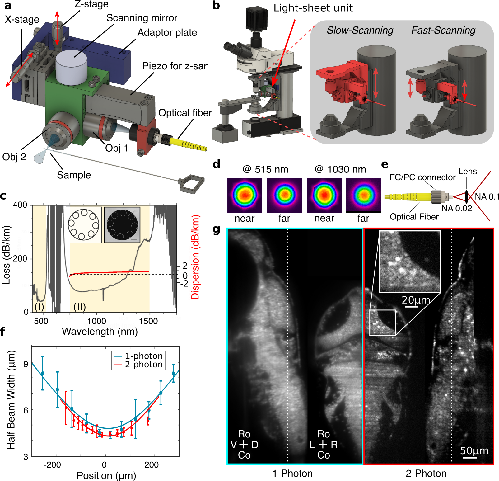

# A Versatile and Open Source One- and Multi-Photon Light-Sheet Microscope Design

<!---  # An Open Source 1P and 2P miniDSPIM with broadband fiber-based laser delivery    --->

<!---  https://github.com/vbormuth/OLU/assets/38736127/c6768a30-e7fc-4b7b-ad6b-9d91b2c9e9b4    --->

## Abstract
Two-photon light sheet microscopy has a wide range of applications in biology. Here we report on a novel open-source design to transform a standard (or brightfield ?) microscope into a 1P \& 2P light-sheet microscope that offers state-of-the-art imaging resolution and speed. The use of a broadband hollow core fiber for laser delivery enables the sharing of the pulsed laser source with other setups, thus largely reducing the effective cost of this system. 

(a) 3D model of the 1P- \& 2P-light-sheet forming unit. (b) 3D design model showing how the one- or two-photon light-sheet unit is mounted on the Scientifica scope. The unit is attached to the motorized stage of the system that moves the objective. (c) The attenuation and dispersion spectrum of the hollow-core negative curvature fiber with two transmission bands (loss $<$ 300dB/km) is highlighted in yellow. Inset left: Schematic of the cross-section of the hypocycloid fiber with 8 cladding tubes. Inset right: EM cross-section image of the fiber (scale bar $10\mu m$). (d) Near and far field profile of the fiber output at 515nm and 1030nm laser wavelength. (e) Schematic of the fiber with its FC/PC connectorization and the lens to increase the numerical aperture (NA) to match the NA of the collimation objective (Obj1 in a). (f) Measured light-sheet profile. (g) Single layers of a volumetric brain scan recorded in one- and two-photon mode of a 6dpf old zebrafish larva expressing pan-neuronally GCaMP6f and localized to the cell nucleus (Elav3-H2B-GCaMP6f).

## BUILDING INSTRUCTIONS:

We provide here a comprehensive online tutorial that features step-by-step building instructions along with 3D animations, illustrations of the construction process, detailed information on the underlying physical principles, and rationale for component selection. In conjunction with the availability of commercially accessible and connectorized broadband optical fiber, our aim is to promote greater accessibility and affordability in the field of multiphoton light-sheet microscopy. To access this invaluable online resource, please follow the links provided below: 

1. [Build first a multicolor one-photon version of the microscope](1P_Multicolor_System.md) with fiber delivery of lasers in the visible spectrum with a standard single-mode optical fiber technology.

2. [Upgrade the one-photon unit into a two-photon system](2P-Upgrade.md) by exploiting advanced hollow core fiber technology.

## Explorable 3D model of the full system

Click the images to open the model browser.

## 3D Animation of the functionality of the system

https://github.com/vbormuth/OLU/assets/38736127/af95fe67-40c8-4dab-be80-82982df7b801

## Slow scan mode

https://user-images.githubusercontent.com/113037893/207926697-6573f5d4-6586-4915-aaef-1366d4b2105a.mp4

## Fast scan mode

https://user-images.githubusercontent.com/113037893/207927665-f9e60bf5-719b-4414-81f9-21bd3844fda7.mp4

## High-resolution zebrafish brain scans (elav3:H2B-GCaMP6)

* Left: one-photon mode excited @ 488nm
* Right:  two-photon mode excited @ 915nm

https://user-images.githubusercontent.com/38736127/178161973-748767bf-004d-487c-9377-4582a705d8d7.mp4

## Spontaneous brain activity recorded in a two-photon mode

https://user-images.githubusercontent.com/38736127/174909302-b3901000-2807-471f-93b6-27f24e98cbe1.mp4

## CAD models

[CAD models](CAD_models)

