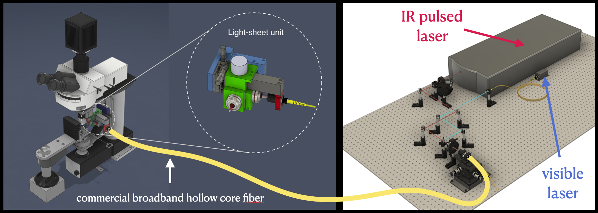
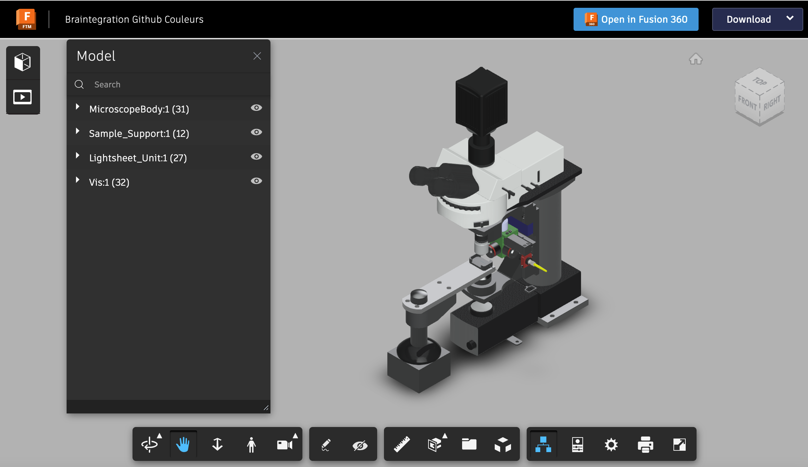
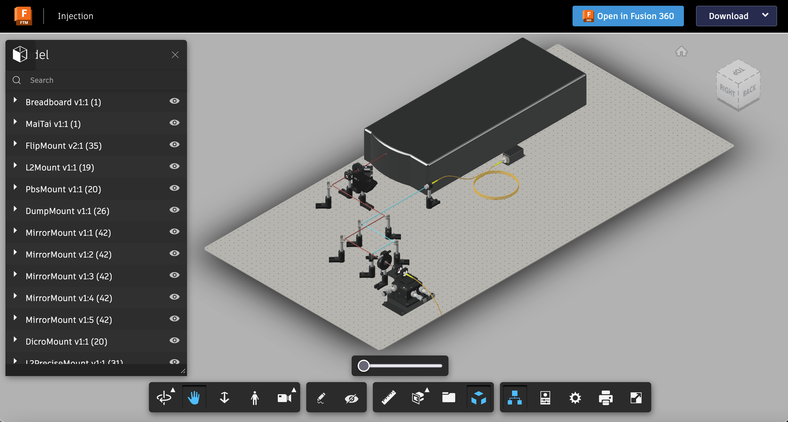

# A Versatile and Open Source One- and Two-Photon Light-Sheet Microscope Design

Two-photon light sheet microscopy offers great potential for a range of biological applications, but its practical implementation is impeded by the high cost of laser sources, the complexity of construction, and the challenges associated with adapting to existing microscope setups. Here, we release an open-source design that addresses these limitations by providing detailed building instructions for the transformation of a brightfield microscope into a versatile one- and two-photon light sheet system.
Our design incorporates a specially designed broadband hollow core fiber, enabling the simultaneous utilization of an expansive pulsed laser source from another setup alongside a visible laser. This integration allows for uncompromised image resolution and speed. Furthermore, the design reduces the complexity of construction, alignment, and overall cost, thereby significantly enhancing the accessibility of this technology.

## BUILDING INSTRUCTIONS:

Here we provide a comprehensive online tutorial that features step-by-step building instructions along with 3D animations, illustrations of the construction process, detailed information on the underlying physical principles, and rationale for components selection. In conjunction with the availability of commercially accessible and connectorized broadband optical fiber, our aim is to promote greater accessibility and affordability in the field of multiphoton light-sheet microscopy. To access this online resource, please follow the links provided below: 

1. [Build first a multicolor one-photon version of the microscope](1P_Multicolor_System.md) with fiber delivery of lasers in the visible spectrum with a standard single-mode optical fiber technology.

2. [Upgrade the one-photon unit into a two-photon system](2P-Upgrade.md) by exploiting advanced hollow core fiber technology.

## Citation:

If you use the hardware designs, please cite us:

[A Versatile and Open Source One- and Two-Photon Light-Sheet Microscope Design]()

Thomas Panier\*, Geoffrey Migault\*, Antoine Hubert, Hugo Trentesaux, Benoît Beaudou, Georges Debrégeas, Volker Bormuth

## Explorable 3D model of the full system

Click the images to open the model browser.

## 3D Animation of the functionality of the system

https://github.com/vbormuth/OLU/assets/38736127/af95fe67-40c8-4dab-be80-82982df7b801

## Slow scan mode

https://user-images.githubusercontent.com/113037893/207926697-6573f5d4-6586-4915-aaef-1366d4b2105a.mp4

## Fast scan mode

https://user-images.githubusercontent.com/113037893/207927665-f9e60bf5-719b-4414-81f9-21bd3844fda7.mp4

## High-resolution zebrafish brain scans (elav3:H2B-GCaMP6)

* Left: one-photon mode excited @ 488nm
* Right:  two-photon mode excited @ 915nm

https://user-images.githubusercontent.com/38736127/178161973-748767bf-004d-487c-9377-4582a705d8d7.mp4

## Spontaneous brain activity recorded in a two-photon mode

https://user-images.githubusercontent.com/38736127/174909302-b3901000-2807-471f-93b6-27f24e98cbe1.mp4

## CAD models

[CAD models](CAD_models)

